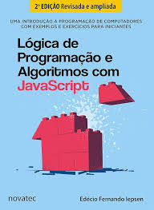

# Iepsen's Logic Book Solutions

## Introduction

This repository contains the solutions to Iepsen's logic and programming algorithms book.

The solutions are organized by chapter, following the format suggested by the author.

The `solutions/` folder contains the official solutions by the author, made available by the publisher.

Work in progress — not all chapters have been solved yet.



## Structure

```
├── cap01/
├── cap02/
├── cap03/
├── cap04/
├── solutions/
├── .gitignore
├── cover.jpeg
├── package.json
├── package-lock.json
└── README.md
````

## Usage

Go to the desired chapter folder to see the solutions for the corresponding exercises.

## Reference

IEPSEN, Édio Fernando. Lógica de Programação e Algoritmos com JavaScript: uma introdução à programação de computadores com exemplos e exercícios para iniciantes. 2. ed. São Paulo: Novatec Editora, 2022.

## License

MIT